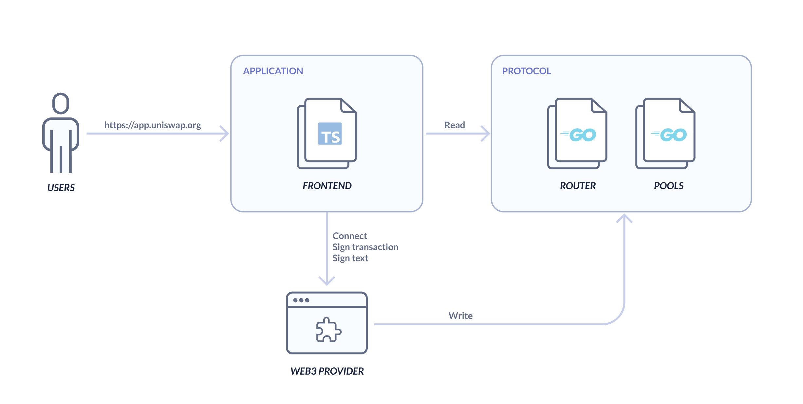
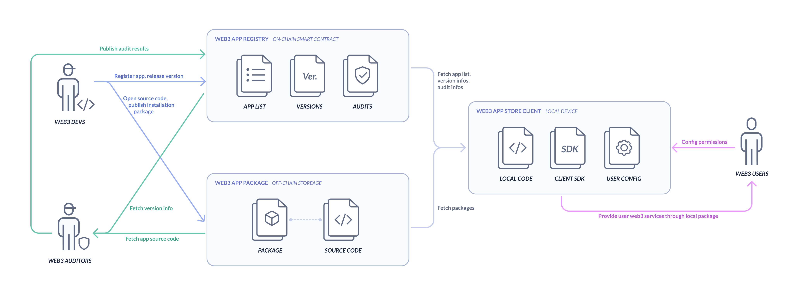

# Web3 App Store Protocol - Standardizes Registration and Distribution for Web3 App

# Background

At present, developers can provide trustless **protocol layer** services to users through a set of smart contracts on blockchain. But the typical, everyday user won't have the ability to understand and use those smart contracts directly - they would need an **application layer** that is trustless, secure and easy to use.

Application layer developers deploy easy-to-use UI to help users interact with protocols and tokens directly. Most of those applications will try to connect to users' Web3 wallet, and request signatures directly. We call those applications "**Web3 App"**. For example, the official web application of Uniswap, which is hosted on https://app.uniswap.org, is a typical Web3 App, which will help user to interact with their own protocol on the blockchain. Here is the tech structure of Uniswap's application and protocol:



# Motivation

As smart contracts on the protocol layer proliferates along side their corresponding Web3 Apps, we still see 2 critical nuisances in currently industry practices — namely around Accessibility and Security:

## Accessibility

Firstly, most Web3 Apps today store their code on the cloud service under the control of the project owner. If the owner takes the website offline, or the website is shut down by DDos or in response to the national policy requirements, etc., a typical user would no longer be able to easily manage their assets (unless they are savvy enough to interact with the protocol layer directly). The uncertainty around access can be scary, which diminishes trust amongst users.

## Security

Secondly, at present, most users access Web3 Apps through the combination of Web browsers and Web3 plugins, a process filled with security issues. Project team and hackers all have the opportunity to embed new malicious code in the Web3 App to steal user's assets. Neither the plugin nor the browser is in a position to alarm a user or to keep him/her safe. This lack of protection basically means the Web3 user would need to be tech and security-savvy, or could easily get chewed up by hacks and leave the crypto world permanently.

# Specification

## Web3 App Store Protocol

We propose a **Web3 App Store Protocol** to solve the Accessibility and Security problems mentioned above. Those app stores should contain a **Web3 App Registry** based on smart contracts, a **Web3 App Packages** based on the additional metadata around permissions, version descriptions, specifications, etc stored off-chain, and a **Web3 App Store Client** installed on users' local devices. After that, we also need **Web3 auditors** to help users audit the source code of Web3 Apps. The relationship across these components is shown as below:



**Web3 App Registry** is a set of smart contracts based on the **Web3 App Registration Standard**. Orgs and individuals can permissionlessly build their own Web3 App Registry. Web3 developers can use their on-chain accounts to register their Web3 App in this registry, and version-manage the distro & checksum of install packages. Auditors can permissionlessly use their on-chain accounts to audit all of those apps and publish the results in the registry.

**Web3 App Packages** refers to the software released by the developers for users to install the Web3 App on their local device. The packages can be stored in any centralized or decentralized storage services, and the url and the checksum of the package should be recorded on the registry. At the same time, based on the **Web3 Application Configuration Standard,** there should be a config file with Web3 App's permission declaration and version description in the root of the package. The storage path of source code should be specified in the config file, for auditor to easily fetch the source code for auditing.

**Web3 App Store Client** is the software installed on user's local device . Orgs and individuals can permissionlessly build their own App Store client based on the **Web3 App Store Client Standard**. Clients can connect to one or more registry at the same time. It needs to fetch the Web3 App list, version infos and audit infos from the registry. When users install or update a Web3 App, they need to automatically fetch the installation package. Then verify the checksum of the package is equal to the checksum in the registry. Finally, it should tell users how many permissions this Web3 app needs. And the Web3 App will be installed on a local device after users confirm the permissions.

This design framework ensures Web3 App accessibility because the user can continue using the old local version — with the right to upgrade depending on the new registry and new app packages.

At the same time, client will verify the checksum of local package with the checksum in registry. so avoiding the change opportunities from hackers or project teams, and ensure that the app used by users is consistent with that published in on-chain registry. And the config file in the package also points to the source code of the current version, and the auditor will be able to verify the package is packaged from those source code through the checksum. It will ensure the source code the consistency between the source code and the installation package, then ensure users use the safe package audited by auditor.

When users use a Web3 app, the client will also limit the permission for those apps based on the app's declaration of permission that user has confirmed before. Then completely **ensure** **the** **security** of user when accessing the local Web3 services.

## Web3 App Registration Standard
```solidity
pragma solidity ^0.8.0;


/**
 * @title AppRegistration interface
 */

interface IAppRegistration {

    struct auditorVote {
        address auditor;
        uint8 level;
    }

    function createApp() external returns (uint256);

    function addVersion(uint256 appId, string memory versionId, string memory fileUrl) external;

    function getAppIds() external returns (uint256[] memory);

    function getVersions(uint256 appId) external returns (string[] memory);

    function getVersionFileUrl(uint256 appId, string memory versionId) external view returns (string memory);

    function voteApp(uint256 appId, uint8 level) external;

    function voteAppVersion(uint256 appId, string memory versionId, uint8 level) external;

    function getVotes(uint256 appId, string memory versionId) external returns (auditorVote[] memory);
}
```

## Web3 App Configration Standard
```json
{
  "properties": {
    "name": {
      "title": "Name of the App",
      "type": "string"
    },
    "logoUrl": {
      "title": "Logo of the App",
      "type": "string"
    },
    "description": {
      "title": "Description of the App",
      "type": "string"
    },
    "origin": {
      "title": "Online dapp origin",
      "type": "string",
      "pattern": "^((https|http)?:\/\/)[^\\s]+"
    },
    "permissions": {
      "properties": {
        "web3Provider": {
          "requestAccount": {
            "title": "If App need permission to connect with wallet",
            "type": "boolean"
          },
          "personalSign": {
            "properties": {
              "request": {
                "type": "boolean",
                "title": "If App need permission to request sign text message"
              },
              "patterns": {
                "type": "array",
                "title": "Patterns of text message" 
              }
            },
            "title": "Declaration for sign text message",
            "type": "object"
          },
          "transaction": {
            "properties": {
              "request": {
                "type": "boolean",
                "title": "If App need permission to request transaction"
              },
              "contractCalls": {
                "type": "array",
                "title": "Declaration for contrat transaction"
              },
              "tokenApproves": {
                "type": "array",
                "title": "Declaration for token approval"
              },
              "ERC20TokenTransfer": {
                "type": "array",
                "title": "Declaration for ERC20 token transfer transaction"
              }
            },
            "type": "object",
            "title": "Declaration for transaction"
          },
          "network": {
            "urlPatterns": {
              "type": "array",
              "title": "Patterns of whitelist network request URL"
            },
            "title": "Declaration for APP network request",
            "type": "object"
          },
          "title": "Declaration for Web3Provider permissions",
          "type": "object"
        }
      },
      "title": "Declaration for App permissions",
      "type": "object"
    },
    "app": {
      "properties": {
        "id": {
          "title": "AppId allocated by App Store",
          "type": "string"
        },
        "chainId": {
          "title": "The chainId which App Store deployed",
          "type": "string"
        },
        "contract": {
          "title": "The contract address of App Store",
          "type": "string" 
        }
      },
      "type": "object",
      "title": "App information on App Store"
    },
    "source": {
      "properties": {
        "repository": {
          "type": "string",
          "title": "The URL that can access App source code",
          "pattern": "^(https:\/\/|git@)[^\\s]+"
        },
        "buildScript": {
          "type": "string",
          "title": "The script that can complie source code to bundles"
        },
        "systemEnvironment": {
          "type": "string",
          "title": "The system environment that can make sure auditor can build bundle which has the same SHA256"
        }
      },
      "type": "object",
      "title": "Information of source code for auditor use"
    }
  },
  "title": "Web3 App json config file",
  "type": "object"
}
```

## Web3 App Store Client Standard
```javascript
interface App {
  app: {
    id: string
    chainId: string
    contract: string
  }
  permissions: {
    network: {
      urlPatterns: string[]
    },
    web3Provider: {
      requestAccount: boolean
      personalSign: {
        request: boolean
        patterns: string[]
      },
      transaction: {
        request: boolean
        contractCalls: ContractCallItem[]
        tokenApproves: TokenApproveItem[]
        ERC20TokenTransfer: ERC20TokenTransferItem[]
      }
    }
  }
  source: {
    repository: string
    buildScript: string
    systemEnvironment: string
  }
  appId: number
  domain: string
  versionId: string
  files: string[]
  name: string
  description?: string
  logoUrl: string
}

enum VoteLevel {
  DANGER = -1
  UNKNOW = 0
  SAFE = 1
}

class Web3AppStore {
  chainId: string; // The chainId which App Store deployed
  
  contract: string; // The contract address of App Store
  
  getApps(): Promise<App[]>
  
  getApp(appId: number, version?: string): Promise<App>
  
  getAppVersions(appId: number): Promise<App[]>
 
  createApp(): Promise<number>
  
  addVersion(appId: number, fileUrls: string[]): Promise<void>
  
  voteApp(appId: number, level: VoteLevel): Promise<void>
  
  voteAppVersion(appId: number, versionId: string, level: VoteLevel): Promise<void>
  
  // Validate the SHA256 of App file is same as versionId of not
  validateAppVersion(app: App): Promise<Boolean>
  
  // Validate if the domain which declared in domain property has the same web3.json file of current App
  validateAppDomain(app: App): Promise<Boolean>
}

```
